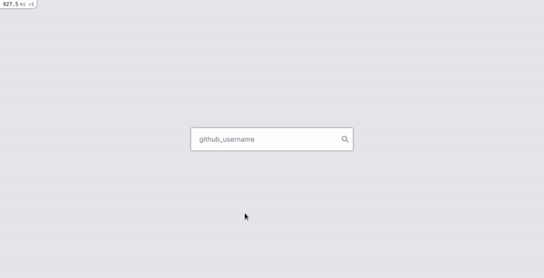

<p align="center">
  <h1 align="center">GitHub Profile Finder</h1>

  <p align="center">A tool that allows anyone to find GitHub users by his username.</p>
</p>

<!-- TABLE OF CONTENTS -->
<details open="open">
  <summary>Table of Contents</summary>
  <ol>
    <li>
      <a href="#about-the-project">About The Project</a>
      <ul>
        <li><a href="#built-with">Built With</a></li>
      </ul>
    </li>
    <li>
      <a href="#getting-started">Getting Started</a>
      <ul>
        <li><a href="#prerequisites">Prerequisites</a></li>
        <li><a href="#installation">Installation</a></li>
      </ul>
    </li>
    <li><a href="#contributing">Contributing</a></li>
    <li><a href="#license">License</a></li>
    <li><a href="#contact">Contact</a></li>
  </ol>
</details>

<!-- ABOUT THE PROJECT -->
## About The Project



A simple tool that allows anyone to find GitHub users by his username.

### Built With

This project was built with:

* [Ruby on Rails](https://rubyonrails.org/)
* [Tailwind CSS](https://tailwindcss.com/)
* [sweetalert2](https://sweetalert2.github.io/)

Extra:

* [Profile Card Template](https://www.tailwindtoolbox.com/templates/profile-card)

<!-- GETTING STARTED -->
## Getting Started

This is an example of how you may give instructions on setting up your project locally.
To get a local copy up and running follow these simple example steps.

### Prerequisites

This is a list of the things you need to use the software.
* [Ruby](http://www.ruby-lang.org/en/)
* [Rails cli](https://rubyonrails.org/)
* [nodejs](https://nodejs.org/en/)
* [yarn](https://yarnpkg.com/)

### Installation

1. Clone the repo
   ```sh
   git clone https://github.com/gentildpinto/gitfinder.git
   ```
2. Install gems with bundler
   ```sh
   bundle install
   ```
3. Install JavaScript packages with yarn
   ```sh
   yarn install
   ```
4. Run the project
   ```sh
   rails s
   ```

<!-- CONTRIBUTING -->
## Contributing

Contributions are what make the open source community such an amazing place to be learn, inspire, and create. Any contributions you make are **greatly appreciated**.

1. Fork the Project
2. Create your Feature Branch (`git checkout -b feature/AmazingFeature`)
3. Commit your Changes (`git commit -m 'Add some AmazingFeature'`)
4. Push to the Branch (`git push origin feature/AmazingFeature`)
5. Open a Pull Request

<!-- LICENSE -->
## License

Distributed under the MIT License. See `LICENSE` for more information.

<!-- CONTACT -->
## Contact

Gentil Pinto - [@gentil__pinto](https://twitter.com/gentil__pinto) - gentil.pinto.dev@gmail.com - [Linkedin](https://www.linkedin.com/in/gentilpinto)
